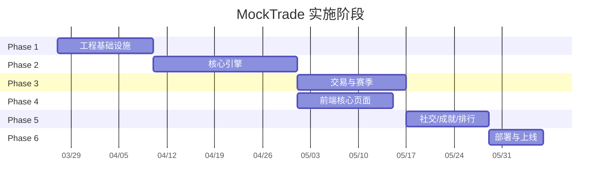
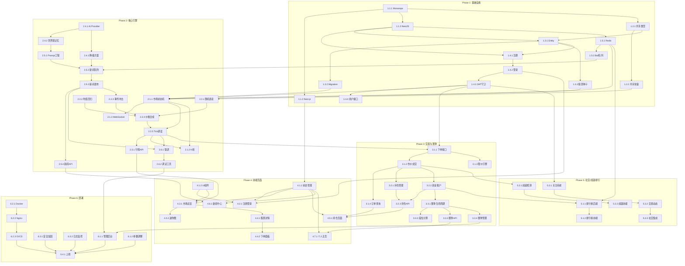

# MockTrade -- WBS 实施计划

**规划时间**: 2026-03-26
**预估总工作量**: 198 任务点 (1 任务点 = 1-2 小时开发时间)
**项目阶段**: 6 个阶段，建议按顺序推进

---

## 目录

1. [功能概述](#1-功能概述)
2. [阶段总览](#2-阶段总览)
3. [WBS 任务分解](#3-wbs-任务分解)
4. [依赖关系](#4-依赖关系)
5. [实施建议](#5-实施建议)
6. [验收标准](#6-验收标准)
7. [后续优化方向](#7-后续优化方向)

---

## 1. 功能概述

### 1.1 目标

构建一个面向家人朋友的娱乐型模拟炒股 Web 游戏。AI 驱动叙事股市，虚拟股票拥有独特人设，新闻事件影响股价走势，玩家在赛季制下竞技排名。

### 1.2 范围

**包含**:
- 完整的 Monorepo 工程基础设施 (前端 Next.js + 后端 NestJS)
- 用户注册/登录/资料管理
- 24/7 行情引擎 (随机游走 + 均值回归 + 事件冲击)
- AI 新闻引擎 (可配置多 AI 提供商 + 降级兜底)
- 交易系统 (市价单/限价单/做市商模式)
- 赛季系统 (月度赛季 + 段位)
- 排行榜 (Redis Sorted Set)
- 成就系统
- 社交功能 (关注/动态/评论)
- 管理后台
- Docker Compose 部署 + CI/CD

**不包含**:
- 真实股票数据接入
- 移动端原生 App
- 支付/充值功能
- 多语言国际化 (Phase 1 仅中文)

### 1.3 技术约束

| 层级 | 技术选型 |
|------|----------|
| 前端 | Next.js 14 (App Router) + TypeScript + TailwindCSS + TradingView Lightweight Charts |
| 后端 | NestJS + TypeScript |
| 数据库 | PostgreSQL (主存储) + Redis (缓存/排行/消息队列) |
| 实时通信 | WebSocket (Socket.IO) |
| AI 服务 | 可配置: OpenAI 兼容 API / Claude API |
| 部署 | Docker Compose on VPS, Nginx 反代 + HTTPS |
| CI/CD | GitHub Actions |

---

## 2. 阶段总览

```
Phase 1: 工程基础设施        [32 点]   -- 地基
Phase 2: 核心引擎            [52 点]   -- 心脏
Phase 3: 交易与赛季          [38 点]   -- 骨架
Phase 4: 前端核心页面        [30 点]   -- 皮肤
Phase 5: 社交/成就/排行      [26 点]   -- 肌肉
Phase 6: 部署与上线          [20 点]   -- 发射
                              --------
                    合计:     198 点
```



> 注: Phase 3 和 Phase 4 可部分并行。Phase 4 在 Phase 2 完成后即可启动前端页面开发。

---

## 3. WBS 任务分解

---

### Phase 1: 工程基础设施 (32 任务点)

> 目标: 搭建完整的开发环境、项目骨架、数据库模型、基础中间件，为后续所有功能提供地基。

---

#### 模块 1.1: Monorepo 项目初始化 (6 任务点)

- [ ] **任务 1.1.1**: 初始化 Monorepo 结构 (2 点)
  - **输入**: 技术栈决策
  - **输出**: 完整的 Monorepo 目录结构
  - **交付物**: 项目根目录配置文件
  - **关键步骤**:
    1. 创建项目根目录，初始化 pnpm workspace
    2. 创建 `packages/` 目录结构:
       ```
       MockTrade/
       ├── apps/
       │   ├── web/          # Next.js 前端
       │   └── server/       # NestJS 后端
       ├── packages/
       │   └── shared/       # 共享类型/常量/工具
       ├── docker/           # Docker 相关配置
       ├── docs/             # 文档
       ├── pnpm-workspace.yaml
       ├── tsconfig.base.json
       └── package.json
       ```
    3. 配置 pnpm-workspace.yaml
    4. 配置根 tsconfig.base.json (路径别名、严格模式)
    5. 配置根 .gitignore、.editorconfig、.prettierrc

- [ ] **任务 1.1.2**: 初始化 Next.js 前端项目 (2 点)
  - **输入**: 任务 1.1.1 的 Monorepo 结构
  - **输出**: 可运行的 Next.js 14 App Router 项目
  - **交付物**: `apps/web/` 目录
  - **关键步骤**:
    1. `create-next-app` 初始化 (App Router, TypeScript, TailwindCSS)
    2. 配置 TailwindCSS 深色主题 (dark mode 为默认)
    3. 配置全局样式: 涨红 (#ef4444) 跌绿 (#22c55e) 色彩变量
    4. 配置路径别名 `@/`
    5. 创建基础 layout.tsx (全局字体、元数据、主题 Provider)
    6. 安装核心依赖: axios, socket.io-client, react-hook-form, zod, zustand
    7. 验证 `pnpm dev` 可正常启动

- [ ] **任务 1.1.3**: 初始化 NestJS 后端项目 (2 点)
  - **输入**: 任务 1.1.1 的 Monorepo 结构
  - **输出**: 可运行的 NestJS 项目
  - **交付物**: `apps/server/` 目录
  - **关键步骤**:
    1. `@nestjs/cli` 初始化项目
    2. 安装核心依赖: @nestjs/typeorm, typeorm, pg, @nestjs/jwt, @nestjs/passport, passport-jwt, bcrypt, class-validator, class-transformer, @nestjs/websockets, @nestjs/platform-socket.io, ioredis, bull
    3. 配置环境变量加载 (@nestjs/config): DATABASE_URL, REDIS_URL, JWT_SECRET, ADMIN_EMAIL, AI_PROVIDER, AI_API_KEY 等
    4. 配置全局 Validation Pipe
    5. 配置全局异常过滤器
    6. 配置 CORS (允许前端域名)
    7. 验证 `pnpm dev` 可正常启动

---

#### 模块 1.2: 共享包与类型定义 (4 任务点)

- [ ] **任务 1.2.1**: 创建共享类型包 (2 点)
  - **输入**: 功能需求文档
  - **输出**: `packages/shared/` 包含所有前后端共享类型
  - **交付物**: `packages/shared/src/types/`
  - **关键步骤**:
    1. 创建 packages/shared 包 (TypeScript 纯库)
    2. 定义用户相关类型:
       ```typescript
       // types/user.ts
       interface User { id, email, username, avatarUrl, role, createdAt }
       type UserRole = 'user' | 'admin'
       interface LoginRequest { email, password }
       interface RegisterRequest { email, password, username, avatarUrl }
       ```
    3. 定义股票相关类型:
       ```typescript
       // types/stock.ts
       interface Stock { id, symbol, name, persona, sector, currentPrice, ... }
       interface StockTick { stockId, price, volume, timestamp }
       interface KLineData { open, high, low, close, volume, timestamp }
       ```
    4. 定义交易相关类型:
       ```typescript
       // types/trade.ts
       type OrderType = 'market' | 'limit'
       type OrderSide = 'buy' | 'sell'
       type OrderStatus = 'pending' | 'filled' | 'cancelled' | 'expired'
       interface Order { id, userId, stockId, type, side, price, quantity, status, ... }
       interface Position { userId, stockId, quantity, avgCost, currentValue, pnl, ... }
       ```
    5. 定义赛季/排行/新闻/成就等类型
    6. 配置 tsconfig 和 package.json 导出

- [ ] **任务 1.2.2**: 创建共享常量和工具函数 (2 点)
  - **输入**: 业务规则
  - **输出**: 共享常量与工具
  - **交付物**: `packages/shared/src/constants/`, `packages/shared/src/utils/`
  - **关键步骤**:
    1. 定义游戏常量:
       ```typescript
       // constants/game.ts
       INITIAL_CAPITAL = 1_000_000
       COMMISSION_RATE = 0.001
       PRICE_LIMIT_PERCENT = 0.10
       MARKET_OPEN_DURATION = 120_000  // 2 min
       MARKET_CLOSE_DURATION = 30_000  // 30 sec
       TICK_INTERVAL_MIN = 2_000       // 2 sec
       TICK_INTERVAL_MAX = 5_000       // 5 sec
       ```
    2. 定义段位常量:
       ```typescript
       // constants/rank.ts
       LEGENDARY_THRESHOLD = 1.0   // >= 100%
       DIAMOND_THRESHOLD   = 0.5   // >= 50%
       GOLD_THRESHOLD      = 0.2   // >= 20%
       SILVER_THRESHOLD    = 0.05  // >= 5%
       ```
    3. 工具函数: 收益率计算、价格格式化、涨跌停判断
    4. WebSocket 事件名枚举:
       ```typescript
       enum WsEvent {
         TICK = 'tick',
         NEWS = 'news',
         ORDER_FILLED = 'order:filled',
         MARKET_STATUS = 'market:status',
       }
       ```

---

#### 模块 1.3: 数据库设计与初始化 (8 任务点)

- [ ] **任务 1.3.1**: 设计并创建核心 Entity (4 点)
  - **输入**: 共享类型定义 (1.2.1)
  - **输出**: TypeORM Entity 文件
  - **交付物**: `apps/server/src/entities/`
  - **关键步骤**:
    1. User Entity:
       - id (UUID), email (unique), passwordHash, username (unique), avatarUrl, role (enum), createdAt, updatedAt
    2. Stock Entity:
       - id (UUID), symbol (unique, 如 "PEAR"), name (如 "梨子科技"), persona (text, AI人设), sector (行业), basePrice (基准价), currentPrice, dailyHigh, dailyLow, openPrice, prevClosePrice, isActive, createdAt
    3. StockTick Entity:
       - id, stockId (FK), price, volume, timestamp
       - 索引: (stockId, timestamp)
    4. Order Entity:
       - id (UUID), userId (FK), stockId (FK), seasonId (FK), type (market/limit), side (buy/sell), price, quantity, filledPrice, filledQuantity, status (enum), createdAt, filledAt
       - 索引: (userId, status), (stockId, status)
    5. Position Entity:
       - id, userId (FK), stockId (FK), seasonId (FK), quantity, avgCost, createdAt, updatedAt
       - 唯一约束: (userId, stockId, seasonId)
    6. Season Entity:
       - id (UUID), name, startDate, endDate, isActive, createdAt
    7. SeasonRecord Entity (赛季结算快照):
       - id, userId (FK), seasonId (FK), finalAssets, returnRate, rank (段位), ranking (名次)
    8. News Entity:
       - id (UUID), title, content, relatedStockIds (JSON), impact (positive/negative/neutral), seasonId (FK), publishedAt
    9. Achievement Entity:
       - id, code (unique), name, description, iconUrl, condition (JSON)
    10. UserAchievement Entity:
        - userId (FK), achievementId (FK), unlockedAt
    11. Follow Entity:
        - followerId (FK), followingId (FK), createdAt
        - 唯一约束: (followerId, followingId)
    12. TradePost Entity (交易动态):
        - id, userId (FK), orderId (FK, nullable), content, createdAt
    13. Comment Entity:
        - id, postId (FK), userId (FK), content, createdAt

- [ ] **任务 1.3.2**: 配置 TypeORM 数据源与 Migration (2 点)
  - **输入**: Entity 定义 (1.3.1)
  - **输出**: 数据库连接配置 + 初始 Migration
  - **交付物**: `apps/server/src/database/`, `apps/server/migrations/`
  - **关键步骤**:
    1. 创建 database.module.ts (TypeORM 异步配置, 从 ConfigService 读取)
    2. 配置 ormconfig.ts (CLI Migration 用)
    3. 生成初始 migration: `typeorm migration:generate`
    4. 编写 seed 脚本: 初始化虚拟股票数据
    5. 验证 migration 可正常执行

- [ ] **任务 1.3.3**: 设计并初始化虚拟股票数据 (2 点)
  - **输入**: 股票人设需求
  - **输出**: 20-30 只虚拟股票的种子数据
  - **交付物**: `apps/server/src/database/seeds/stocks.seed.ts`
  - **关键步骤**:
    1. 设计 20-30 只股票，分为两类:
       - **半虚拟型** (模仿真实公司): PEAR (梨子科技), GOGGLE (护目镜搜索), TESLAA (特斯拉拉), AMZONE (亚马逊逊), NETTFLIX (网飞飞)
       - **谐音型** (纯娱乐): HOTPOT (火锅控股), MALATANG (麻辣烫集团), MILKTEA (奶茶科技), JIANBING (煎饼果子网络), CHUANR (串儿传媒)
    2. 为每只股票设定:
       - symbol, name, sector (科技/餐饮/娱乐/金融/能源...)
       - basePrice (基准价, 10-500 不等)
       - persona (人设文本, 供 AI 使用):
         ```
         例: HOTPOT -- "火锅控股是全球最大的连锁火锅企业，CEO 张麻辣是个性情中人，
         经常在社交媒体上发表争议言论。公司正在研发自动涮肉机器人。"
         ```
    3. 设定股票间关系 (供 AI 叙事):
       - 竞争关系: HOTPOT vs MALATANG
       - 合作关系: MILKTEA + JIANBING
       - 供应链: CHUANR -> HOTPOT
    4. 编写 seed 执行脚本, 支持 `pnpm seed` 命令

---

#### 模块 1.4: 认证与用户系统 (10 任务点)

- [ ] **任务 1.4.1**: 实现用户注册接口 (3 点)
  - **输入**: User Entity (1.3.1)
  - **输出**: POST /api/auth/register
  - **交付物**: `apps/server/src/modules/auth/`
  - **关键步骤**:
    1. 创建 AuthModule, AuthController, AuthService
    2. 实现注册逻辑:
       - 验证 DTO (email 格式, 密码长度>=8, username 非空)
       - 检查 email / username 唯一性
       - bcrypt 加密密码 (saltRounds=12)
       - 创建用户记录
       - 根据 ADMIN_EMAIL 环境变量自动赋予 admin 角色
       - 生成 JWT token 返回
    3. 头像处理: 支持上传或从预设头像选择
    4. 错误处理: 邮箱已注册、用户名已占用

- [ ] **任务 1.4.2**: 实现用户登录接口 (2 点)
  - **输入**: User Entity (1.3.1)
  - **输出**: POST /api/auth/login
  - **交付物**: `apps/server/src/modules/auth/auth.controller.ts`
  - **关键步骤**:
    1. 验证 DTO (email, password)
    2. 查询用户, bcrypt.compare 验证密码
    3. 生成 JWT token (payload: userId, email, role; expiresIn: 7d)
    4. 返回 token + 用户基本信息
    5. 错误处理: 用户不存在、密码错误 (统一返回"邮箱或密码错误")

- [ ] **任务 1.4.3**: 实现 JWT 守卫与角色装饰器 (2 点)
  - **输入**: JWT 配置
  - **输出**: 全局可用的认证守卫
  - **交付物**: `apps/server/src/common/guards/`, `apps/server/src/common/decorators/`
  - **关键步骤**:
    1. 实现 JwtStrategy (passport-jwt)
    2. 实现 JwtAuthGuard (全局可选)
    3. 实现 @CurrentUser() 参数装饰器
    4. 实现 RolesGuard + @Roles('admin') 装饰器
    5. 实现 @Public() 装饰器 (标记无需认证的接口)

- [ ] **任务 1.4.4**: 实现用户资料接口 (2 点)
  - **输入**: 认证守卫 (1.4.3)
  - **输出**: GET/PATCH /api/users/me, GET /api/users/:id
  - **交付物**: `apps/server/src/modules/user/`
  - **关键步骤**:
    1. 创建 UserModule, UserController, UserService
    2. GET /api/users/me -- 获取当前用户信息
    3. PATCH /api/users/me -- 修改用户名、头像
    4. GET /api/users/:id -- 查看他人主页 (公开信息)
    5. GET /api/users/:id/stats -- 用户统计 (总资产、收益率、交易次数)

- [ ] **任务 1.4.5**: 编写认证模块单元测试 (1 点)
  - **输入**: Auth 模块代码
  - **输出**: 测试文件
  - **交付物**: `apps/server/src/modules/auth/__tests__/`
  - **关键步骤**:
    1. 注册: 正常注册、重复邮箱、重复用户名、无效输入
    2. 登录: 正常登录、错误密码、不存在的用户
    3. JWT: token 生成、验证、过期处理

---

#### 模块 1.5: Redis 基础配置 (4 任务点)

- [ ] **任务 1.5.1**: 配置 Redis 连接与模块 (2 点)
  - **输入**: Redis 连接信息 (环境变量)
  - **输出**: 全局可注入的 Redis 服务
  - **交付物**: `apps/server/src/modules/redis/`
  - **关键步骤**:
    1. 创建 RedisModule (全局模块)
    2. 使用 ioredis 创建连接 (支持 REDIS_URL)
    3. 封装 RedisService: get/set/del/expire, hGet/hSet, zAdd/zRange/zRevRange, publish/subscribe
    4. 连接健康检查

- [ ] **任务 1.5.2**: 配置 Bull 消息队列 (2 点)
  - **输入**: Redis 连接 (1.5.1)
  - **输出**: 可用的 Bull 队列基础设施
  - **交付物**: `apps/server/src/modules/queue/`
  - **关键步骤**:
    1. 安装 @nestjs/bull
    2. 创建 QueueModule 注册 Bull (连接到 Redis)
    3. 预定义队列名:
       - `news-generation` (AI 新闻生成)
       - `order-processing` (订单处理)
       - `achievement-check` (成就检测)
       - `season-settlement` (赛季结算)
    4. 配置队列监控 (Bull Board, 仅 admin 可访问)

---

### Phase 2: 核心引擎 (52 任务点)

> 目标: 实现行情引擎和 AI 新闻引擎，这是游戏的核心心脏。行情引擎驱动价格变化，AI 新闻引擎创造叙事。

---

#### 模块 2.1: 行情引擎 -- 市场状态管理 (8 任务点)

- [ ] **任务 2.1.1**: 实现市场状态机 (3 点)
  - **输入**: 游戏常量 (1.2.2)
  - **输出**: 市场开盘/休市状态管理
  - **交付物**: `apps/server/src/modules/market/market-state.service.ts`
  - **关键步骤**:
    1. 定义状态枚举: `OPENING (开盘中)`, `CLOSED (休市中)`, `SETTLING (结算中)`
    2. 实现 24/7 循环逻辑:
       ```
       开盘 (2 min) -> 结算 (收盘价快照) -> 休市 (30 sec) -> 开盘 ...
       ```
    3. 使用 setTimeout/setInterval 实现状态切换
    4. 每次切换时通过 WebSocket 广播 `market:status` 事件
    5. 服务启动时自动开始循环 (OnModuleInit)
    6. 休市期间: 冻结价格、拒绝市价单、保留限价单

- [ ] **任务 2.1.2**: 实现每日 K 线数据管理 (2 点)
  - **输入**: StockTick Entity
  - **输出**: K 线数据聚合与查询服务
  - **交付物**: `apps/server/src/modules/market/kline.service.ts`
  - **关键步骤**:
    1. 每个交易周期 (2min) 视为"一天"
    2. 记录每个交易周期的 OHLCV (开高低收量)
    3. 提供查询接口: 最近 N 个周期的 K 线数据
    4. Redis 缓存最近 100 根 K 线

- [ ] **任务 2.1.3**: 实现 WebSocket 网关 (3 点)
  - **输入**: NestJS WebSocket 配置
  - **输出**: Socket.IO 网关
  - **交付物**: `apps/server/src/modules/websocket/`
  - **关键步骤**:
    1. 创建 WsGateway (@WebSocketGateway)
    2. 处理连接/断开事件, JWT 认证
    3. 实现 Room 机制:
       - `market` -- 全局行情推送
       - `stock:{id}` -- 单只股票详情
       - `user:{id}` -- 个人通知
    4. 定义推送事件:
       - `tick` -- 价格更新 {stockId, price, change, volume}
       - `news` -- 新闻推送 {title, content, impact}
       - `market:status` -- 市场状态变化
       - `order:filled` -- 订单成交通知
    5. 心跳检测, 自动重连支持

---

#### 模块 2.2: 行情引擎 -- 价格算法 (12 任务点)

- [ ] **任务 2.2.1**: 实现随机游走基础算法 (3 点)
  - **输入**: 股票基准价
  - **输出**: 价格生成器
  - **交付物**: `apps/server/src/modules/market/engine/random-walk.ts`
  - **关键步骤**:
    1. 几何布朗运动 (GBM) 模型:
       ```
       dS = mu * S * dt + sigma * S * sqrt(dt) * Z
       其中 Z ~ N(0, 1)
       ```
    2. 每只股票独立的 mu (漂移率) 和 sigma (波动率)
    3. 不同行业有不同的默认波动率:
       - 科技: sigma = 0.03 (高波动)
       - 餐饮: sigma = 0.015 (中波动)
       - 金融: sigma = 0.01 (低波动)
    4. 生成的价格保留 2 位小数, 最低 0.01

- [ ] **任务 2.2.2**: 实现均值回归机制 (2 点)
  - **输入**: 基准价, 当前价
  - **输出**: 均值回归修正因子
  - **交付物**: `apps/server/src/modules/market/engine/mean-reversion.ts`
  - **关键步骤**:
    1. 当价格偏离基准价过远时, 增加回归力:
       ```
       deviation = (currentPrice - basePrice) / basePrice
       reversionForce = -kappa * deviation
       // kappa 为回归速度系数, 建议 0.01 - 0.05
       ```
    2. 偏离 >50% 时加大回归力度
    3. 偏离 >80% 时强制回归 (防止价格失控)

- [ ] **任务 2.2.3**: 实现事件冲击系统 (3 点)
  - **输入**: AI 新闻事件
  - **输出**: 价格冲击因子
  - **交付物**: `apps/server/src/modules/market/engine/event-impact.ts`
  - **关键步骤**:
    1. 定义冲击等级:
       ```
       MINOR:  +-1% ~ 3%   (小新闻)
       MEDIUM: +-3% ~ 6%   (中等事件)
       MAJOR:  +-6% ~ 10%  (重大事件)
       ```
    2. 冲击衰减: 冲击力随时间指数衰减
       ```
       currentImpact = initialImpact * exp(-lambda * t)
       ```
    3. 支持关联冲击: 一个事件影响多只股票
       - 直接关联: 100% 冲击
       - 间接关联 (同行业): 30% 冲击
       - 供应链关联: 50% 冲击
    4. 新闻发布后注入冲击到价格引擎

- [ ] **任务 2.2.4**: 实现涨跌停与价格合成 (2 点)
  - **输入**: 随机游走 + 均值回归 + 事件冲击
  - **输出**: 最终价格
  - **交付物**: `apps/server/src/modules/market/engine/price-synthesizer.ts`
  - **关键步骤**:
    1. 合成公式:
       ```
       newPrice = currentPrice * (1 + randomWalk + meanReversion + eventImpact)
       ```
    2. 涨跌停限制 (每个交易周期):
       ```
       upperLimit = openPrice * 1.10
       lowerLimit = openPrice * 0.90
       newPrice = clamp(newPrice, lowerLimit, upperLimit)
       ```
    3. 触及涨跌停时广播特殊事件
    4. 价格变化百分比计算 (相对开盘价)

- [ ] **任务 2.2.5**: 实现 Tick 调度器 (2 点)
  - **输入**: 价格合成器, 市场状态
  - **输出**: 定时 Tick 推送
  - **交付物**: `apps/server/src/modules/market/engine/tick-scheduler.ts`
  - **关键步骤**:
    1. 仅在 OPENING 状态时运行
    2. 每 2-5 秒 (随机间隔) 为每只股票生成一个 tick
    3. 每次 tick:
       - 调用价格合成器计算新价格
       - 更新 Stock.currentPrice (数据库 + Redis)
       - 存储 StockTick 记录
       - 通过 WebSocket 广播
    4. 批量处理: 一次 tick 更新所有活跃股票
    5. 性能: 单次 tick 处理时间 < 200ms

---

#### 模块 2.3: 行情引擎 -- API 接口 (4 任务点)

- [ ] **任务 2.3.1**: 实现股票列表与详情接口 (2 点)
  - **输入**: Stock Entity, Redis 缓存
  - **输出**: REST API
  - **交付物**: `apps/server/src/modules/market/market.controller.ts`
  - **关键步骤**:
    1. GET /api/market/stocks -- 所有股票列表 (带实时价格)
    2. GET /api/market/stocks/:id -- 单只股票详情
    3. GET /api/market/stocks/:id/kline?periods=100 -- K 线数据
    4. GET /api/market/status -- 当前市场状态 (开盘/休市, 倒计时)
    5. Redis 缓存: 股票列表缓存 5 秒 (因为 tick 频繁更新)

- [ ] **任务 2.3.2**: 实现行情引擎测试 (2 点)
  - **输入**: 引擎代码
  - **输出**: 单元测试 + 集成测试
  - **交付物**: `apps/server/src/modules/market/__tests__/`
  - **关键步骤**:
    1. 随机游走: 验证价格分布合理性 (1000 次模拟)
    2. 均值回归: 验证偏离后回归趋势
    3. 涨跌停: 验证价格不超限
    4. 事件冲击: 验证冲击衰减曲线
    5. 集成测试: 完整 tick 周期流程

---

#### 模块 2.4: AI 新闻引擎 -- AI 适配层 (8 任务点)

- [ ] **任务 2.4.1**: 设计 AI Provider 抽象接口 (2 点)
  - **输入**: 多 AI 提供商需求
  - **输出**: 统一的 AI 调用接口
  - **交付物**: `apps/server/src/modules/ai/`
  - **关键步骤**:
    1. 定义抽象接口:
       ```typescript
       interface AIProvider {
         generateText(prompt: string, options?: AIOptions): Promise<string>
         generateJSON<T>(prompt: string, schema: ZodSchema<T>): Promise<T>
       }
       ```
    2. 实现 OpenAICompatibleProvider (支持任何 OpenAI 兼容 API):
       - baseUrl, apiKey, model 均可配置
    3. 实现 ClaudeProvider (Anthropic API):
       - apiKey, model 可配置
    4. 通过环境变量 AI_PROVIDER 选择:
       ```
       AI_PROVIDER=openai  # 或 claude
       AI_API_BASE=https://api.openai.com/v1
       AI_API_KEY=sk-...
       AI_MODEL=gpt-4o
       ```
    5. AIModule 注册为全局模块, 注入时自动选择 provider

- [ ] **任务 2.4.2**: 实现世界观记忆系统 (3 点)
  - **输入**: 股票人设, Redis
  - **输出**: AI 上下文管理服务
  - **交付物**: `apps/server/src/modules/ai/world-memory.service.ts`
  - **关键步骤**:
    1. 世界设定文档 (存储在配置/数据库):
       ```
       "这是一个平行宇宙的股票市场，名为 MockTrade 交易所。
       这里的公司都有着荒诞但又似乎合理的商业模式..."
       ```
    2. 记忆层级:
       - **永久记忆**: 世界观、股票人设、股票间关系图
       - **赛季记忆**: 当前赛季的重大事件线 (Redis Hash)
       - **短期记忆**: 最近 20 条新闻摘要 (Redis List)
    3. 构建 AI prompt 时自动注入相关记忆:
       ```
       [世界观] + [相关股票人设] + [近期事件] + [生成指令]
       ```
    4. 记忆更新: 每次生成新闻后, 自动将摘要加入短期记忆
    5. 赛季重置时清理赛季记忆和短期记忆

- [ ] **任务 2.4.3**: 实现 AI 降级兜底方案 (3 点)
  - **输入**: 新闻模板
  - **输出**: 模板新闻生成器
  - **交付物**: `apps/server/src/modules/ai/fallback-generator.ts`
  - **关键步骤**:
    1. 预设 50+ 条新闻模板:
       ```
       正面: "{stock_name}宣布{product}销量突破{number}万台"
       负面: "{stock_name}CEO在直播中不慎说出公司{secret}"
       中性: "{stock_name}将于下周发布{quarter}季度财报"
       ```
    2. 模板变量随机填充
    3. 与股票人设匹配 (不同股票使用不同模板)
    4. 调用 AI 失败时自动切换到模板模式
    5. 重试策略: 失败后重试 2 次, 最终降级到模板

---

#### 模块 2.5: AI 新闻引擎 -- 新闻生成与调度 (12 任务点)

- [ ] **任务 2.5.1**: 实现新闻生成 Prompt 工程 (4 点)
  - **输入**: 世界观记忆, 股票人设
  - **输出**: 高质量新闻生成 prompt
  - **交付物**: `apps/server/src/modules/news/prompts/`
  - **关键步骤**:
    1. 设计 System Prompt:
       ```
       你是 MockTrade 交易所的首席新闻编辑。你需要为虚拟股市生成新闻。
       新闻应该幽默、夸张但有内在逻辑。每条新闻都会影响股价。
       ```
    2. 新闻类型 prompt:
       - **突发新闻**: 重大事件, 影响 1-3 只股票
       - **行业分析**: 分析某行业趋势, 影响同行业股票
       - **CEO 八卦**: 基于人设的 CEO 趣闻
       - **产品发布**: 新产品上市
       - **财报**: 季度业绩
       - **跨公司事件**: 合作/竞争/收购
    3. 输出格式约束 (JSON):
       ```json
       {
         "title": "标题 (20字以内)",
         "content": "正文 (100-200字)",
         "impact": "positive | negative | neutral",
         "impactLevel": "minor | medium | major",
         "relatedStocks": ["HOTPOT", "MALATANG"],
         "storylineId": "可选, 连续剧情线ID"
       }
       ```
    4. 连续剧情线 prompt: 给定之前的剧情, 生成后续发展
    5. prompt 模板支持变量替换, 易于调优

- [ ] **任务 2.5.2**: 实现新闻预生成队列 (3 点)
  - **输入**: Bull 队列 (1.5.2), AI Provider (2.4.1)
  - **输出**: 后台新闻生成与缓存
  - **交付物**: `apps/server/src/modules/news/news-generator.service.ts`
  - **关键步骤**:
    1. 使用 Bull 队列 `news-generation`:
       - 定时触发: 每个交易周期开始时, 确保队列中有 3-5 条待发布新闻
       - 队列长度 < 3 时自动触发生成任务
    2. 生成流程:
       ```
       触发 -> 构建 prompt (含记忆) -> 调用 AI -> 解析 JSON ->
       验证格式 -> 存入 Redis 待发布队列 -> 更新记忆
       ```
    3. 生成失败处理: 重试 -> 降级到模板
    4. 新闻去重: 短时间内不重复提及同一股票
    5. Redis 待发布队列: `news:pending` (List)

- [ ] **任务 2.5.3**: 实现新闻发布调度器 (3 点)
  - **输入**: 待发布队列, 市场状态
  - **输出**: 定时发布新闻
  - **交付物**: `apps/server/src/modules/news/news-publisher.service.ts`
  - **关键步骤**:
    1. 发布策略:
       - 每个交易周期 (2min) 发布 1-3 条新闻
       - 开盘后 10s 发布第一条 (给玩家反应时间)
       - 随机间隔发布后续新闻
    2. 发布流程:
       ```
       从 Redis 队列取出 -> 存入数据库 (News Entity) ->
       触发价格冲击 (调用事件冲击系统) ->
       WebSocket 广播 -> 更新 AI 记忆
       ```
    3. 休市期间不发布新闻
    4. 特殊事件: 开盘前 "早间新闻汇总" (可选)

- [ ] **任务 2.5.4**: 实现新闻 API 接口 (2 点)
  - **输入**: News Entity
  - **输出**: REST API
  - **交付物**: `apps/server/src/modules/news/news.controller.ts`
  - **关键步骤**:
    1. GET /api/news -- 新闻列表 (分页, 按时间倒序)
    2. GET /api/news/:id -- 新闻详情
    3. GET /api/news?stockId=xxx -- 某股票相关新闻
    4. GET /api/news/latest -- 最新 5 条新闻 (轮播用)

---

#### 模块 2.6: 引擎集成与调试 (8 任务点)

- [ ] **任务 2.6.1**: 行情引擎与新闻引擎联调 (4 点)
  - **输入**: 行情引擎, 新闻引擎
  - **输出**: 完整的 "新闻 -> 股价" 联动
  - **交付物**: 集成测试用例
  - **关键步骤**:
    1. 验证新闻发布后价格冲击正确触发
    2. 验证正面新闻导致股价上涨, 负面新闻导致下跌
    3. 验证冲击衰减曲线符合预期
    4. 验证关联冲击 (同行业、供应链) 正确传播
    5. 压力测试: 同时发布多条新闻, 验证引擎稳定性
    6. 长时间运行测试: 连续运行 1 小时, 观察价格分布

- [ ] **任务 2.6.2**: 实现管理员调试工具 (4 点)
  - **输入**: 行情引擎, 新闻引擎
  - **输出**: 管理员 API
  - **交付物**: `apps/server/src/modules/admin/`
  - **关键步骤**:
    1. POST /api/admin/market/pause -- 暂停行情
    2. POST /api/admin/market/resume -- 恢复行情
    3. POST /api/admin/market/speed -- 调整 tick 速度
    4. POST /api/admin/news/generate -- 手动触发新闻生成
    5. POST /api/admin/news/publish -- 手动发布指定新闻
    6. POST /api/admin/stocks/:id/shock -- 手动注入价格冲击
    7. GET /api/admin/engine/status -- 引擎状态仪表盘
    8. 所有接口需要 admin 角色

---

### Phase 3: 交易与赛季 (38 任务点)

> 目标: 实现交易下单、持仓管理、盈亏计算和赛季系统，让玩家能真正 "炒股"。

---

#### 模块 3.1: 交易系统 -- 订单处理 (14 任务点)

- [ ] **任务 3.1.1**: 实现下单接口 (4 点)
  - **输入**: Order Entity, 行情数据
  - **输出**: POST /api/trade/orders
  - **交付物**: `apps/server/src/modules/trade/`
  - **关键步骤**:
    1. 创建 TradeModule, TradeController, TradeService
    2. 下单 DTO 验证:
       - stockId: 股票必须存在且活跃
       - type: market | limit
       - side: buy | sell
       - quantity: 正整数, 最小 1 股
       - price: 限价单必须提供, 市价单忽略
    3. 买入前置检查:
       - 市场必须处于 OPENING 状态 (市价单)
       - 限价单可在休市时下
       - 可用资金 >= quantity * price * (1 + COMMISSION_RATE)
    4. 卖出前置检查:
       - 持有该股票数量 >= quantity
    5. 市价单: 立即以当前价成交 (做市商模式)
    6. 限价单: 挂入待成交队列 (Redis)

- [ ] **任务 3.1.2**: 实现市价单即时成交 (3 点)
  - **输入**: 当前行情, 订单
  - **输出**: 成交结果
  - **交付物**: `apps/server/src/modules/trade/matching/market-order.ts`
  - **关键步骤**:
    1. 做市商模式: 玩家直接与市场成交, 无需撮合
    2. 成交价 = 当前市场价
    3. 手续费计算: filledPrice * filledQuantity * 0.001
    4. 买入成交:
       - 扣除资金 (成交金额 + 手续费)
       - 增加持仓 (更新 Position, 重新计算 avgCost)
    5. 卖出成交:
       - 增加资金 (成交金额 - 手续费)
       - 减少持仓 (数量为 0 时保留记录用于历史)
    6. 更新 Order 状态为 filled
    7. 所有操作在数据库事务中完成
    8. WebSocket 通知用户: `order:filled`

- [ ] **任务 3.1.3**: 实现限价单匹配引擎 (4 点)
  - **输入**: 限价单队列, tick 数据
  - **输出**: 限价单自动匹配
  - **交付物**: `apps/server/src/modules/trade/matching/limit-order.ts`
  - **关键步骤**:
    1. 限价单存储 (Redis Sorted Set):
       - `limit:buy:{stockId}` -- 按价格降序 (优先匹配高价买单)
       - `limit:sell:{stockId}` -- 按价格升序 (优先匹配低价卖单)
    2. 每次 tick 后检查:
       - 买入限价单: 如果 currentPrice <= limitPrice, 成交
       - 卖出限价单: 如果 currentPrice >= limitPrice, 成交
    3. 成交流程与市价单相同 (3.1.2)
    4. 限价单过期: 休市时清除未成交的限价单 (或保留到下个交易周期, 可配置)
    5. 取消限价单: DELETE /api/trade/orders/:id

- [ ] **任务 3.1.4**: 实现订单查询接口 (2 点)
  - **输入**: Order Entity
  - **输出**: 订单查询 API
  - **交付物**: `apps/server/src/modules/trade/trade.controller.ts`
  - **关键步骤**:
    1. GET /api/trade/orders -- 我的订单列表 (分页, 可筛选状态)
    2. GET /api/trade/orders/:id -- 订单详情
    3. GET /api/trade/orders/active -- 当前活跃订单 (pending 状态)
    4. DELETE /api/trade/orders/:id -- 取消限价单

- [ ] **任务 3.1.5**: 编写交易模块测试 (1 点)
  - **输入**: 交易模块代码
  - **输出**: 测试文件
  - **交付物**: `apps/server/src/modules/trade/__tests__/`
  - **关键步骤**:
    1. 市价买入: 正常成交, 资金不足, 市场关闭
    2. 市价卖出: 正常成交, 持仓不足
    3. 限价单: 创建, 匹配, 过期, 取消
    4. 手续费计算验证
    5. 并发下单测试

---

#### 模块 3.2: 持仓与资产管理 (8 任务点)

- [ ] **任务 3.2.1**: 实现持仓管理服务 (3 点)
  - **输入**: Position Entity, 实时行情
  - **输出**: 持仓计算服务
  - **交付物**: `apps/server/src/modules/trade/position.service.ts`
  - **关键步骤**:
    1. 获取用户持仓列表 (含实时市值):
       ```typescript
       interface PositionVO {
         stockId: string
         stockName: string
         quantity: number
         avgCost: number       // 持仓均价
         currentPrice: number  // 实时价
         marketValue: number   // 市值 = quantity * currentPrice
         pnl: number           // 盈亏 = marketValue - quantity * avgCost
         pnlPercent: number    // 盈亏比 = pnl / (quantity * avgCost)
       }
       ```
    2. 计算总资产: 可用资金 + 所有持仓市值
    3. 计算总收益率: (总资产 - 初始资金) / 初始资金

- [ ] **任务 3.2.2**: 实现资金账户服务 (3 点)
  - **输入**: 赛季系统
  - **输出**: 资金管理
  - **交付物**: `apps/server/src/modules/trade/account.service.ts`
  - **关键步骤**:
    1. 用户资金存储:
       - Redis: `account:{userId}:{seasonId}` (高频读写)
       - 数据库: 定期持久化 (每分钟/每次交易)
    2. 资金操作:
       - 冻结资金 (下限价买单时)
       - 解冻资金 (取消限价买单时)
       - 扣除资金 (成交买入)
       - 增加资金 (成交卖出)
    3. 资金流水记录 (用于对账):
       - type: trade_buy, trade_sell, commission, season_init
    4. 赛季开始时初始化: $1,000,000

- [ ] **任务 3.2.3**: 实现持仓与资产 API (2 点)
  - **输入**: 持仓服务, 资金服务
  - **输出**: REST API
  - **交付物**: controller 补充
  - **关键步骤**:
    1. GET /api/trade/positions -- 我的持仓列表
    2. GET /api/trade/account -- 我的资金账户 (可用资金, 冻结资金, 总资产)
    3. GET /api/trade/account/history -- 资金流水
    4. GET /api/trade/portfolio -- 投资组合概览 (饼图数据: 各股票占比)

---

#### 模块 3.3: 赛季系统 (10 任务点)

- [ ] **任务 3.3.1**: 实现赛季生命周期管理 (4 点)
  - **输入**: Season Entity
  - **输出**: 赛季创建/结算服务
  - **交付物**: `apps/server/src/modules/season/`
  - **关键步骤**:
    1. 创建 SeasonModule, SeasonService
    2. 赛季创建:
       - 每月 1 号 00:00 自动创建新赛季 (Bull cron job)
       - 或管理员手动创建
       - 设置 name, startDate, endDate
    3. 赛季初始化:
       - 为所有已注册用户初始化资金 $1,000,000
       - 清空所有持仓
       - 重置股票价格到基准价
       - 清理 AI 赛季记忆
    4. 赛季结算 (endDate 到达时):
       - 强制平仓所有持仓 (以当前价)
       - 计算每个用户的最终资产和收益率
       - 计算段位: 传奇/钻石/黄金/白银/青铜
       - 生成 SeasonRecord
       - 排名

- [ ] **任务 3.3.2**: 实现段位计算与展示 (2 点)
  - **输入**: 收益率数据
  - **输出**: 段位服务
  - **交付物**: `apps/server/src/modules/season/rank.service.ts`
  - **关键步骤**:
    1. 段位计算:
       ```
       returnRate >= 100%  -> 传奇 (Legendary) -- 紫色
       returnRate >= 50%   -> 钻石 (Diamond)   -- 蓝色
       returnRate >= 20%   -> 黄金 (Gold)       -- 金色
       returnRate >= 5%    -> 白银 (Silver)     -- 银色
       returnRate < 5%     -> 青铜 (Bronze)     -- 铜色
       ```
    2. 段位徽章 icon 设计 (SVG)
    3. 赛季进行中也实时显示 "当前段位" (基于当前收益率)
    4. 历史最高段位记录

- [ ] **任务 3.3.3**: 实现赛季 API (2 点)
  - **输入**: 赛季服务
  - **输出**: REST API
  - **交付物**: `apps/server/src/modules/season/season.controller.ts`
  - **关键步骤**:
    1. GET /api/seasons -- 赛季列表 (含当前活跃赛季)
    2. GET /api/seasons/current -- 当前赛季详情
    3. GET /api/seasons/:id -- 历史赛季详情
    4. GET /api/seasons/:id/results -- 赛季结果排名
    5. GET /api/seasons/my-history -- 我的赛季历史记录

- [ ] **任务 3.3.4**: 实现赛季管理接口 (2 点)
  - **输入**: 赛季服务
  - **输出**: 管理员 API
  - **交付物**: admin controller 补充
  - **关键步骤**:
    1. POST /api/admin/seasons -- 手动创建赛季
    2. POST /api/admin/seasons/:id/end -- 手动结束赛季
    3. POST /api/admin/seasons/:id/reset -- 重置赛季 (测试用)
    4. PATCH /api/admin/seasons/:id -- 修改赛季参数

---

#### 模块 3.4: 交易模块集成测试 (6 任务点)

- [ ] **任务 3.4.1**: 完整交易流程集成测试 (3 点)
  - **输入**: 交易系统 + 行情引擎 + 赛季系统
  - **输出**: 端到端测试
  - **交付物**: `apps/server/test/trade-integration.spec.ts`
  - **关键步骤**:
    1. 场景 1: 用户注册 -> 赛季开始 -> 买入 -> 持仓更新 -> 卖出 -> 盈亏计算
    2. 场景 2: 下限价单 -> 价格触发 -> 自动成交
    3. 场景 3: 新闻发布 -> 股价变化 -> 涨停/跌停
    4. 场景 4: 赛季结束 -> 强制平仓 -> 段位计算 -> 排名

- [ ] **任务 3.4.2**: 性能与并发测试 (3 点)
  - **输入**: 交易系统
  - **输出**: 性能测试报告
  - **交付物**: `apps/server/test/performance/`
  - **关键步骤**:
    1. 模拟 50 用户同时下单
    2. 验证资金计算无并发问题 (乐观锁/事务)
    3. Tick + 限价单匹配性能 (1000 挂单情况)
    4. WebSocket 广播性能 (100 连接)

---

### Phase 4: 前端核心页面 (30 任务点)

> 目标: 实现所有核心前端页面和交互，让游戏可玩。

---

#### 模块 4.1: 前端基础架构 (6 任务点)

- [ ] **任务 4.1.1**: 搭建前端状态管理与基础设施 (3 点)
  - **输入**: Next.js 项目 (1.1.2)
  - **输出**: 全局状态管理, API 封装, WebSocket 客户端
  - **交付物**: `apps/web/src/lib/`, `apps/web/src/stores/`
  - **关键步骤**:
    1. Zustand Store:
       - authStore: 用户信息, token, login/logout
       - marketStore: 股票列表, 实时价格, 市场状态
       - tradeStore: 持仓, 订单, 资金
       - newsStore: 新闻列表
    2. API 封装 (axios):
       - baseURL 配置
       - 请求拦截器: 自动添加 JWT token
       - 响应拦截器: 401 自动跳转登录
       - 类型安全的 API 函数
    3. WebSocket 客户端:
       - 自动连接/重连
       - 事件监听: tick, news, order:filled, market:status
       - 接收数据自动更新对应 store
    4. 工具函数: 数字格式化, 涨跌色, 时间格式化

- [ ] **任务 4.1.2**: 实现通用 UI 组件库 (3 点)
  - **输入**: TailwindCSS, 设计规范
  - **输出**: 可复用组件
  - **交付物**: `apps/web/src/components/ui/`
  - **关键步骤**:
    1. Button (主要/次要/危险, 加载状态)
    2. Input, Select, Checkbox (表单组件)
    3. Modal, Drawer (弹窗/抽屉)
    4. Table (数据表格, 支持排序)
    5. Card (卡片容器)
    6. Badge (段位徽章, 成就徽章)
    7. Toast (全局提示)
    8. Loading, Skeleton (加载状态)
    9. PriceText (价格文字, 自动涨红跌绿)
    10. PercentText (百分比文字, 自动涨红跌绿, 带箭头)
    11. Avatar (用户头像)
    12. Tabs (标签页切换)

---

#### 模块 4.2: 注册登录页面 (3 任务点)

- [ ] **任务 4.2.1**: 实现注册登录页面 (3 点)
  - **输入**: Auth API (1.4.1, 1.4.2)
  - **输出**: 完整的注册登录流程
  - **交付物**: `apps/web/src/app/(auth)/`
  - **关键步骤**:
    1. 登录页 `/login`:
       - 邮箱 + 密码表单
       - react-hook-form + zod 验证
       - 错误提示
       - "还没有账号? 去注册" 链接
    2. 注册页 `/register`:
       - 邮箱 + 密码 + 确认密码 + 用户名 + 头像选择
       - 头像: 提供 12 个预设头像供选择 (或上传自定义)
       - 实时检查用户名是否可用
    3. 登录成功后:
       - 存储 token 到 localStorage
       - 更新 authStore
       - 跳转到市场总览页
    4. 路由守卫: 未登录用户重定向到 /login
    5. 页面设计: 深色背景, 居中卡片式布局, MockTrade Logo

---

#### 模块 4.3: 市场总览页面 (6 任务点)

- [ ] **任务 4.3.1**: 实现市场总览页面 (4 点)
  - **输入**: 行情 API + WebSocket
  - **输出**: 主页面
  - **交付物**: `apps/web/src/app/(main)/market/page.tsx`
  - **关键步骤**:
    1. 顶部状态栏:
       - 市场状态 (开盘中/休市中) + 倒计时
       - 当前赛季名称
       - 用户资产概览 (总资产, 今日盈亏)
    2. 新闻滚动条 (Marquee):
       - 最新 5 条新闻标题滚动显示
       - 点击跳转新闻详情
    3. 股票列表 (表格):
       - 列: 代码, 名称, 当前价, 涨跌额, 涨跌幅, 成交量
       - 实时更新 (WebSocket tick)
       - 涨跌幅文字自动红绿变色
       - 涨停/跌停标记
       - 点击行跳转股票详情
    4. 排序: 按涨跌幅/价格/代码
    5. 行业筛选: 全部/科技/餐饮/娱乐/金融/能源
    6. 响应式: 移动端表格横向滚动

- [ ] **任务 4.3.2**: 实现迷你走势图 (2 点)
  - **输入**: TradingView Lightweight Charts
  - **输出**: 股票列表中的迷你趋势线
  - **交付物**: `apps/web/src/components/charts/MiniChart.tsx`
  - **关键步骤**:
    1. 每只股票行内显示最近 30 个 tick 的迷你趋势线
    2. 使用 TradingView Lightweight Charts 的 LineSeries
    3. 尺寸: 120px * 40px
    4. 颜色: 涨为红色, 跌为绿色
    5. 无坐标轴, 纯走势线

---

#### 模块 4.4: 股票详情页面 (6 任务点)

- [ ] **任务 4.4.1**: 实现股票详情页面与图表 (4 点)
  - **输入**: 行情 API, K 线数据, WebSocket
  - **输出**: 股票详情页
  - **交付物**: `apps/web/src/app/(main)/stock/[id]/page.tsx`
  - **关键步骤**:
    1. 股票头部信息:
       - 名称, 代码, 行业, 人设简介
       - 当前价 (大字体), 涨跌额, 涨跌幅
       - 今日开盘价, 最高, 最低, 成交量
    2. K 线图 / 趋势图切换:
       - **K 线图** (CandlestickSeries): OHLC 蜡烛图
       - **趋势图** (LineSeries): 分时走势
       - 使用 TradingView Lightweight Charts
       - 实时更新 (WebSocket 订阅 `stock:{id}` room)
    3. 成交量柱状图 (HistogramSeries): 附在图表下方
    4. 涨跌停参考线 (水平虚线)
    5. 新闻标记: 在图表上标注新闻发布时间点

- [ ] **任务 4.4.2**: 实现下单面板 (2 点)
  - **输入**: 交易 API
  - **输出**: 买入/卖出面板
  - **交付物**: `apps/web/src/components/trade/OrderPanel.tsx`
  - **关键步骤**:
    1. 买入/卖出 Tab 切换
    2. 市价单/限价单切换
    3. 输入: 价格 (限价单), 数量
    4. 快捷按钮: 1/4 仓, 1/2 仓, 全仓
    5. 预计费用 (含手续费) 实时计算
    6. 可用资金 / 可卖数量 显示
    7. 确认下单 (二次确认弹窗)
    8. 成交结果通知 (Toast)

---

#### 模块 4.5: 交易与持仓页面 (4 任务点)

- [ ] **任务 4.5.1**: 实现持仓与订单页面 (4 点)
  - **输入**: 交易 API
  - **输出**: 持仓/订单管理页
  - **交付物**: `apps/web/src/app/(main)/portfolio/page.tsx`
  - **关键步骤**:
    1. 资产概览卡片:
       - 总资产, 可用资金, 持仓市值, 冻结资金
       - 总收益, 总收益率, 当前段位
    2. 持仓列表:
       - 股票名, 持仓数量, 持仓均价, 当前价, 市值, 盈亏, 盈亏比
       - 实时更新
       - 点击跳转股票详情
       - 快速卖出按钮
    3. 当前委托 (活跃限价单):
       - 股票, 方向, 价格, 数量, 下单时间
       - 取消按钮
    4. 历史订单 (分页):
       - 所有已成交/已取消订单
       - 筛选: 全部/买入/卖出/已成交/已取消
    5. 投资组合饼图 (可选):
       - 各股票市值占比
       - 使用简单的 SVG 圆环图

---

#### 模块 4.6: 新闻中心页面 (3 任务点)

- [ ] **任务 4.6.1**: 实现新闻中心页面 (3 点)
  - **输入**: 新闻 API, WebSocket
  - **输出**: 新闻列表与详情
  - **交付物**: `apps/web/src/app/(main)/news/page.tsx`
  - **关键步骤**:
    1. 新闻列表 (时间线布局):
       - 标题, 时间, 影响标签 (利好/利空/中性)
       - 相关股票标签 (可点击)
       - 最新新闻自动插入到顶部 (WebSocket)
       - 加载更多 (分页)
    2. 新闻详情 (点击展开或模态框):
       - 完整内容
       - 相关股票的实时价格
       - "前往交易" 快捷按钮
    3. 筛选: 全部/利好/利空/按股票筛选
    4. 新闻推送提示: 有新新闻时页面顶部弹出提示条

---

#### 模块 4.7: 个人主页 (2 任务点)

- [ ] **任务 4.7.1**: 实现个人主页 (2 点)
  - **输入**: 用户 API, 赛季 API
  - **输出**: 个人资料页
  - **交付物**: `apps/web/src/app/(main)/profile/[id]/page.tsx`
  - **关键步骤**:
    1. 用户信息卡片: 头像, 用户名, 注册时间, 最高段位
    2. 本赛季战绩: 总资产, 收益率, 段位, 排名
    3. 赛季历史: 列表展示历史赛季成绩
    4. 成就展示: 已解锁的成就徽章
    5. 编辑资料 (自己的主页): 修改用户名, 头像

---

### Phase 5: 社交/成就/排行 (26 任务点)

> 目标: 增强社交互动和游戏化体验。

---

#### 模块 5.1: 排行榜 (8 任务点)

- [ ] **任务 5.1.1**: 实现排行榜后端 (4 点)
  - **输入**: Redis Sorted Set, 赛季数据
  - **输出**: 排行榜服务
  - **交付物**: `apps/server/src/modules/leaderboard/`
  - **关键步骤**:
    1. Redis Sorted Set 键设计:
       ```
       lb:{seasonId}:assets     -- 总资产排行
       lb:{seasonId}:return     -- 收益率排行
       lb:{seasonId}:weekly     -- 周之星 (本周收益率)
       lb:{seasonId}:winrate    -- 胜率排行 (盈利交易/总交易)
       lb:{seasonId}:bottom     -- 抄底大师 (最低买入后涨幅)
       ```
    2. 更新时机:
       - 每次交易成交后更新相关排行
       - 每个交易周期结束时批量更新总资产排行
    3. API:
       - GET /api/leaderboard/:type -- 排行榜 (top 100)
       - GET /api/leaderboard/:type/my-rank -- 我的排名
    4. 缓存策略: 排行榜数据缓存 10 秒

- [ ] **任务 5.1.2**: 实现排行榜前端 (4 点)
  - **输入**: 排行榜 API
  - **输出**: 排行榜页面
  - **交付物**: `apps/web/src/app/(main)/leaderboard/page.tsx`
  - **关键步骤**:
    1. Tab 切换: 总资产 / 收益率 / 周之星 / 胜率 / 抄底大师
    2. 排行列表:
       - 排名, 头像, 用户名, 段位徽章, 对应数值
       - 前三名特殊样式 (金银铜)
       - 高亮当前用户
    3. 赛季切换: 当前赛季 / 历史赛季
    4. 我的排名: 底部固定显示当前用户排名
    5. 点击用户名跳转个人主页

---

#### 模块 5.2: 成就系统 (8 任务点)

- [ ] **任务 5.2.1**: 实现成就定义与检测 (4 点)
  - **输入**: Achievement Entity, Bull 队列
  - **输出**: 成就检测服务
  - **交付物**: `apps/server/src/modules/achievement/`
  - **关键步骤**:
    1. 预定义成就 (种子数据):
       ```
       - 初来乍到: 完成第一笔交易
       - 小试牛刀: 单笔盈利超过 10%
       - 稳如老狗: 连续 10 笔交易盈利
       - 抄底猎人: 在跌停价买入后涨幅超过 15%
       - 追涨杀手: 在涨停价卖出
       - 韭菜之王: 单笔亏损超过 50%
       - 新闻嗅觉: 在新闻发布后 10 秒内交易
       - 传奇玩家: 赛季段位达到传奇
       - 社交达人: 获得 10 个关注者
       - 全仓梭哈: 单笔交易使用超过 90% 资金
       - 分散投资: 同时持有 10 只以上股票
       - 空仓大师: 赛季中连续 24 小时不持仓且盈利
       ```
    2. 成就检测触发时机:
       - 交易成交后 -> 检测交易类成就
       - 赛季结算时 -> 检测赛季类成就
       - 社交操作后 -> 检测社交类成就
    3. 使用 Bull 队列异步检测 (不阻塞主流程)
    4. 解锁时 WebSocket 通知用户

- [ ] **任务 5.2.2**: 实现成就 API 与前端 (4 点)
  - **输入**: 成就服务
  - **输出**: API + 前端展示
  - **交付物**: controller + `apps/web/src/app/(main)/achievements/page.tsx`
  - **关键步骤**:
    1. API:
       - GET /api/achievements -- 所有成就列表 (含解锁状态)
       - GET /api/achievements/my -- 我的已解锁成就
    2. 前端成就页:
       - 网格展示所有成就
       - 已解锁: 彩色 + 解锁时间
       - 未解锁: 灰色 + 解锁条件
       - 进度条 (如: 连续盈利 7/10 笔)
    3. 成就解锁弹窗: 解锁瞬间全屏动画通知

---

#### 模块 5.3: 社交功能 (10 任务点)

- [ ] **任务 5.3.1**: 实现关注系统 (3 点)
  - **输入**: Follow Entity
  - **输出**: 关注/取关 + 列表
  - **交付物**: `apps/server/src/modules/social/`
  - **关键步骤**:
    1. POST /api/social/follow/:userId -- 关注
    2. DELETE /api/social/follow/:userId -- 取关
    3. GET /api/social/following -- 我关注的人
    4. GET /api/social/followers -- 关注我的人
    5. GET /api/users/:id/follow-stats -- 关注数/粉丝数
    6. 防止自己关注自己

- [ ] **任务 5.3.2**: 实现交易动态 (4 点)
  - **输入**: TradePost Entity, Comment Entity
  - **输出**: 动态发布/浏览
  - **交付物**: `apps/server/src/modules/social/post.service.ts`, `apps/web/src/app/(main)/feed/page.tsx`
  - **关键步骤**:
    1. 后端 API:
       - POST /api/posts -- 发布动态 (可关联订单)
       - GET /api/posts/feed -- 关注的人的动态 (时间线)
       - GET /api/posts/user/:id -- 某用户的动态
       - POST /api/posts/:id/comments -- 评论
       - GET /api/posts/:id/comments -- 评论列表
    2. 自动生成交易动态 (可选):
       - 大额交易自动生成 "xxx 买入了 HOTPOT 1000 股"
       - 用户可选择是否公开交易
    3. 前端动态页:
       - 时间线列表 (类似微博)
       - 动态卡片: 头像, 用户名, 内容, 时间, 关联订单信息
       - 评论展开/折叠
       - 发布动态框

- [ ] **任务 5.3.3**: 前端社交组件集成 (3 点)
  - **输入**: 社交 API
  - **输出**: 各页面集成社交功能
  - **交付物**: 组件与页面更新
  - **关键步骤**:
    1. 个人主页增加: 关注/取关按钮, 关注数/粉丝数, 动态列表
    2. 市场页增加: "好友在交易" 侧边栏 (关注的人最近交易)
    3. 股票详情增加: "最近交易此股票的人" 列表
    4. 全局通知: 被关注、被评论时的通知

---

### Phase 6: 部署与上线 (20 任务点)

> 目标: 容器化部署、管理后台完善、安全加固、上线。

---

#### 模块 6.1: 管理后台 (6 任务点)

- [ ] **任务 6.1.1**: 实现管理后台前端 (4 点)
  - **输入**: Admin API (2.6.2, 3.3.4)
  - **输出**: 管理后台页面
  - **交付物**: `apps/web/src/app/(admin)/`
  - **关键步骤**:
    1. 管理后台布局 (侧边栏导航)
    2. 仪表盘:
       - 在线用户数, 总用户数, 当前赛季, 引擎状态
       - 今日交易量, 新闻发布数
    3. 股票管理:
       - 股票列表, 编辑人设, 调整基准价/波动率
       - 手动注入价格冲击
    4. 新闻管理:
       - 新闻列表, 手动生成, 手动发布
       - AI 配置 (provider, model, temperature)
    5. 赛季管理:
       - 赛季列表, 创建/结束赛季
    6. 用户管理:
       - 用户列表, 查看详情
    7. 仅 admin 角色可访问 (前端路由守卫 + 后端接口守卫)

- [ ] **任务 6.1.2**: 实现参数调整后台 (2 点)
  - **输入**: 游戏参数
  - **输出**: 运行时参数调整
  - **交付物**: admin 页面补充
  - **关键步骤**:
    1. 行情参数: tick 间隔, 开盘时长, 休市时长
    2. 交易参数: 手续费率, 初始资金
    3. AI 参数: 生成频率, temperature, 最大 tokens
    4. 修改后实时生效 (通过 Redis 存储, 引擎读取)
    5. 参数修改日志

---

#### 模块 6.2: Docker 与部署 (8 任务点)

- [ ] **任务 6.2.1**: 编写 Docker 配置 (3 点)
  - **输入**: 项目代码
  - **输出**: Docker 镜像构建配置
  - **交付物**: `docker/`, `docker-compose.yml`
  - **关键步骤**:
    1. 前端 Dockerfile (多阶段构建):
       ```dockerfile
       # Stage 1: 安装依赖
       # Stage 2: 构建 Next.js
       # Stage 3: 生产镜像 (standalone 模式)
       ```
    2. 后端 Dockerfile (多阶段构建):
       ```dockerfile
       # Stage 1: 安装依赖
       # Stage 2: 构建 NestJS
       # Stage 3: 生产镜像
       ```
    3. docker-compose.yml:
       ```yaml
       services:
         web:       # Next.js 前端
         server:    # NestJS 后端
         postgres:  # PostgreSQL
         redis:     # Redis
         nginx:     # Nginx 反代
       ```
    4. docker-compose.override.yml (开发环境, volume 映射)
    5. .env.example (所有环境变量模板)

- [ ] **任务 6.2.2**: 配置 Nginx 反向代理 (2 点)
  - **输入**: 部署需求
  - **输出**: Nginx 配置
  - **交付物**: `docker/nginx/`
  - **关键步骤**:
    1. HTTP -> HTTPS 重定向
    2. 路由规则:
       ```
       /              -> web:3000     (Next.js)
       /api/          -> server:3001  (NestJS REST)
       /socket.io/    -> server:3001  (WebSocket)
       ```
    3. SSL 证书配置 (Let's Encrypt / certbot)
    4. WebSocket 升级配置 (Upgrade, Connection headers)
    5. Gzip 压缩
    6. 静态资源缓存头

- [ ] **任务 6.2.3**: 编写 CI/CD Pipeline (3 点)
  - **输入**: GitHub Actions
  - **输出**: 自动构建与部署流程
  - **交付物**: `.github/workflows/`
  - **关键步骤**:
    1. CI 流程 (push/PR 触发):
       ```
       代码检出 -> pnpm install -> lint -> type check ->
       单元测试 -> 构建检查
       ```
    2. CD 流程 (main 分支合并触发):
       ```
       构建 Docker 镜像 -> 推送到 Registry ->
       SSH 到 VPS -> docker compose pull && docker compose up -d
       ```
    3. 环境变量: GitHub Secrets 管理
    4. 部署通知 (可选: 发送到群组)
    5. 回滚脚本

---

#### 模块 6.3: 安全加固与监控 (4 任务点)

- [ ] **任务 6.3.1**: 安全加固 (2 点)
  - **输入**: 安全需求
  - **输出**: 安全配置
  - **交付物**: 各模块安全更新
  - **关键步骤**:
    1. Rate Limiting (nestjs-throttler):
       - 全局: 100 req/min
       - 登录接口: 5 req/min (防暴力破解)
       - 交易接口: 30 req/min
    2. Helmet (HTTP 安全头)
    3. CORS 严格配置 (仅允许前端域名)
    4. SQL 注入防护 (TypeORM 参数化查询)
    5. XSS 防护 (输出转义)
    6. JWT token 安全: HttpOnly cookie 或严格的 localStorage 管理

- [ ] **任务 6.3.2**: 日志与监控 (2 点)
  - **输入**: 部署环境
  - **输出**: 日志与监控配置
  - **交付物**: 日志模块
  - **关键步骤**:
    1. 结构化日志 (winston/pino):
       - 请求日志 (method, url, status, duration)
       - 错误日志 (stack trace)
       - 引擎日志 (tick, news, match)
    2. 日志文件轮转 (docker logs 或文件)
    3. 健康检查端点: GET /api/health
       - 数据库连接状态
       - Redis 连接状态
       - 行情引擎状态
       - AI 服务状态
    4. 简单的监控仪表盘 (admin 页面内)

---

#### 模块 6.4: 上线前检查 (2 任务点)

- [ ] **任务 6.4.1**: 端到端测试与上线 (2 点)
  - **输入**: 完整系统
  - **输出**: 上线检查清单
  - **交付物**: 部署完成
  - **关键步骤**:
    1. 端到端流程验证:
       - 注册 -> 登录 -> 浏览行情 -> 下单 -> 持仓 -> 卖出 -> 查看排行
    2. WebSocket 连接测试 (多设备)
    3. 移动端响应式检查
    4. AI 新闻生成验证
    5. 赛季流程验证 (手动创建/结束)
    6. 性能检查: 首页加载 < 3s, API 响应 < 200ms
    7. 备份策略: PostgreSQL 定时备份
    8. 域名 DNS 配置
    9. SSL 证书确认

---

## 4. 依赖关系

### 4.1 依赖关系图



### 4.2 关键依赖说明

| 任务 | 依赖于 | 原因 |
|------|--------|------|
| 2.1.1 市场状态机 | 1.3.2 Migration, 1.3.3 股票种子 | 引擎需要数据库和股票数据 |
| 2.2.4 价格合成 | 2.2.1, 2.2.2, 2.2.3 | 合成三种算法的结果 |
| 2.5.3 新闻发布 | 2.2.3 事件冲击 | 新闻发布后需触发价格冲击 |
| 3.1.1 下单接口 | 2.2.5 Tick调度 | 交易依赖实时行情 |
| 3.1.3 限价引擎 | 2.2.5 Tick调度 | 限价单匹配依赖每次 tick |
| 4.3.1 市场总览 | 2.3.1 行情API | 前端需要后端行情数据 |
| 4.4.2 下单面板 | 3.1.1 下单接口 | 前端下单需要后端 API |
| 5.1.1 排行榜后端 | 3.2.2 资金账户 | 排行依赖资产数据 |
| 6.1.1 管理后台 | 2.6.2 调试工具, 3.3.4 赛季管理 | 后台聚合所有管理 API |

### 4.3 可并行开发的任务组

以下任务组之间无依赖，可以并行推进:

**Phase 1 内部并行:**
- 1.1.2 Next.js 初始化 || 1.1.3 NestJS 初始化 || 1.2.1 共享类型
- 1.4.x 认证系统 || 1.5.x Redis 配置

**Phase 2 内部并行:**
- 2.1.x 市场状态 || 2.4.x AI 适配层 (互不依赖, 最终在 2.6.1 联调)
- 2.2.1 随机游走 || 2.2.2 均值回归 || 2.2.3 事件冲击 (三个算法独立开发)

**Phase 3 与 Phase 4 并行:**
- Phase 3 交易后端 || Phase 4 前端基础架构 + 注册登录 + 市场总览 (后端 API ready 前, 前端可用 mock 数据)

**Phase 5 内部并行:**
- 5.1 排行榜 || 5.2 成就系统 || 5.3 社交功能 (三个模块相互独立)

**Phase 6 内部并行:**
- 6.1 管理后台 || 6.2 Docker 部署 || 6.3 安全加固 (三条线并行)

---

## 5. 实施建议

### 5.1 技术选型补充

| 需求 | 推荐方案 | 理由 |
|------|----------|------|
| ORM | TypeORM | NestJS 官方集成, 支持 Migration, 类型安全 |
| 表单验证 (后端) | class-validator + class-transformer | NestJS 内置 Pipe 支持 |
| 表单验证 (前端) | react-hook-form + zod | 性能好, zod 可前后端共享 |
| 状态管理 | Zustand | 轻量, TypeScript 友好, 无 boilerplate |
| API 请求 | axios | 拦截器生态成熟 |
| 图表 | TradingView Lightweight Charts | 专为金融图表设计, 轻量 (40KB), 性能优秀 |
| 消息队列 | Bull (基于 Redis) | NestJS 官方集成, 支持 cron/延迟/重试 |
| 日志 | Pino | 高性能 JSON 日志, NestJS 有 nestjs-pino 集成 |
| 密码哈希 | bcrypt | 业界标准, 自带 salt |

### 5.2 潜在风险

| 风险 | 影响 | 缓解措施 |
|------|------|----------|
| AI API 不稳定/响应慢 | 高 | 预生成队列 + 模板降级兜底 (已设计在 2.4.3) |
| 行情引擎内存泄漏 (长时间运行) | 高 | 定时器清理, 内存监控, 自动重启策略 |
| 并发交易的资金一致性 | 高 | 数据库事务 + Redis 原子操作 + 乐观锁 |
| WebSocket 连接数过多 | 中 | Socket.IO 适配器支持 Redis 横向扩展 |
| K 线数据量增长 | 中 | StockTick 定期归档, 只保留近 N 个周期原始数据 |
| AI 生成内容不可控 | 中 | 内容审核过滤, 管理员审核队列 (可选) |
| 单 VPS 性能瓶颈 | 低 | 初期用户量小; 后期可拆分服务 |

### 5.3 测试策略

- **单元测试**: 价格算法 (随机游走/均值回归/涨跌停), 交易撮合逻辑, 资金计算, 段位计算
- **集成测试**: 完整交易流程, 新闻->股价联动, 赛季生命周期
- **E2E 测试**: 注册->登录->看行情->下单->查持仓->查排行
- **压力测试**: 50 并发用户交易, 100 WebSocket 连接
- **工具**: Jest (后端), Vitest (前端), Playwright (E2E, 可选)

### 5.4 建议的执行顺序 (Sprint 计划)

```
Sprint 1 (Week 1-2):   Phase 1 全部
Sprint 2 (Week 3-4):   Phase 2 模块 2.1 + 2.2 (行情引擎)
Sprint 3 (Week 5-6):   Phase 2 模块 2.4 + 2.5 (AI 新闻引擎) + 2.6 (联调)
Sprint 4 (Week 7-8):   Phase 3 (交易与赛季) + Phase 4 模块 4.1 + 4.2 (前端基础)
Sprint 5 (Week 9-10):  Phase 4 模块 4.3-4.7 (前端页面)
Sprint 6 (Week 11-12): Phase 5 (社交/成就/排行)
Sprint 7 (Week 13-14): Phase 6 (部署上线)
```

> 以上 Sprint 计划假设单人全职开发。如果多人协作, Phase 3 和 Phase 4 可由不同人并行推进, 总时长可压缩至 10 周左右。

---

## 6. 验收标准

### 6.1 功能验收

- [ ] 用户可以注册/登录, 设置用户名和头像
- [ ] 行情引擎 24/7 运行, 开盘 2 分钟休市 30 秒循环
- [ ] 20-30 只虚拟股票实时价格更新, 涨跌停 +-10%
- [ ] AI 新闻自动生成并影响股价, AI 不可用时模板兜底
- [ ] 用户可以市价/限价买卖股票, 手续费 0.1%
- [ ] 持仓和盈亏实时更新
- [ ] 赛季按月运行, 初始资金 $1,000,000, 段位正确计算
- [ ] 排行榜 5 个维度均可查看
- [ ] 成就可正常解锁
- [ ] 用户间可关注、发布动态、评论
- [ ] 管理后台可管理股票、新闻、赛季、参数
- [ ] Docker Compose 一键部署, HTTPS 访问

### 6.2 技术验收

- [ ] 单元测试覆盖率 >= 70% (核心模块 >= 85%)
- [ ] 首页加载时间 < 3 秒
- [ ] API 响应时间 < 200ms (P95)
- [ ] WebSocket 消息延迟 < 100ms
- [ ] 支持 50 并发用户无明显卡顿
- [ ] 无高优先级 Bug
- [ ] 代码 lint 无错误

---

## 7. 后续优化方向

Phase 2 (上线后) 可考虑的增强:

- **融资融券**: 杠杆交易, 增加策略深度
- **期权/期货**: 衍生品交易
- **私人房间**: 创建私密竞技房, 自定义规则
- **策略回测**: 历史数据回测交易策略
- **移动端 App**: React Native 或 PWA
- **多语言**: i18n 国际化
- **观战模式**: 直播其他玩家的交易操作
- **AI 对手**: AI 控制的 NPC 交易者, 增加市场深度
- **更丰富的叙事**: AI 生成连续剧情, 公司 IPO/退市/并购事件
- **数据可视化**: 更丰富的统计图表, 交易日志分析

---

## 附录: 任务点汇总

| 阶段 | 模块 | 任务点 |
|------|------|--------|
| Phase 1 | 1.1 Monorepo 初始化 | 6 |
| Phase 1 | 1.2 共享包 | 4 |
| Phase 1 | 1.3 数据库 | 8 |
| Phase 1 | 1.4 认证用户 | 10 |
| Phase 1 | 1.5 Redis | 4 |
| **Phase 1 小计** | | **32** |
| Phase 2 | 2.1 市场状态 | 8 |
| Phase 2 | 2.2 价格算法 | 12 |
| Phase 2 | 2.3 行情 API | 4 |
| Phase 2 | 2.4 AI 适配层 | 8 |
| Phase 2 | 2.5 新闻引擎 | 12 |
| Phase 2 | 2.6 集成调试 | 8 |
| **Phase 2 小计** | | **52** |
| Phase 3 | 3.1 订单处理 | 14 |
| Phase 3 | 3.2 持仓资产 | 8 |
| Phase 3 | 3.3 赛季系统 | 10 |
| Phase 3 | 3.4 集成测试 | 6 |
| **Phase 3 小计** | | **38** |
| Phase 4 | 4.1 前端基础 | 6 |
| Phase 4 | 4.2 注册登录 | 3 |
| Phase 4 | 4.3 市场总览 | 6 |
| Phase 4 | 4.4 股票详情 | 6 |
| Phase 4 | 4.5 持仓页面 | 4 |
| Phase 4 | 4.6 新闻中心 | 3 |
| Phase 4 | 4.7 个人主页 | 2 |
| **Phase 4 小计** | | **30** |
| Phase 5 | 5.1 排行榜 | 8 |
| Phase 5 | 5.2 成就系统 | 8 |
| Phase 5 | 5.3 社交功能 | 10 |
| **Phase 5 小计** | | **26** |
| Phase 6 | 6.1 管理后台 | 6 |
| Phase 6 | 6.2 Docker 部署 | 8 |
| Phase 6 | 6.3 安全监控 | 4 |
| Phase 6 | 6.4 上线检查 | 2 |
| **Phase 6 小计** | | **20** |
| **总计** | | **198** |
